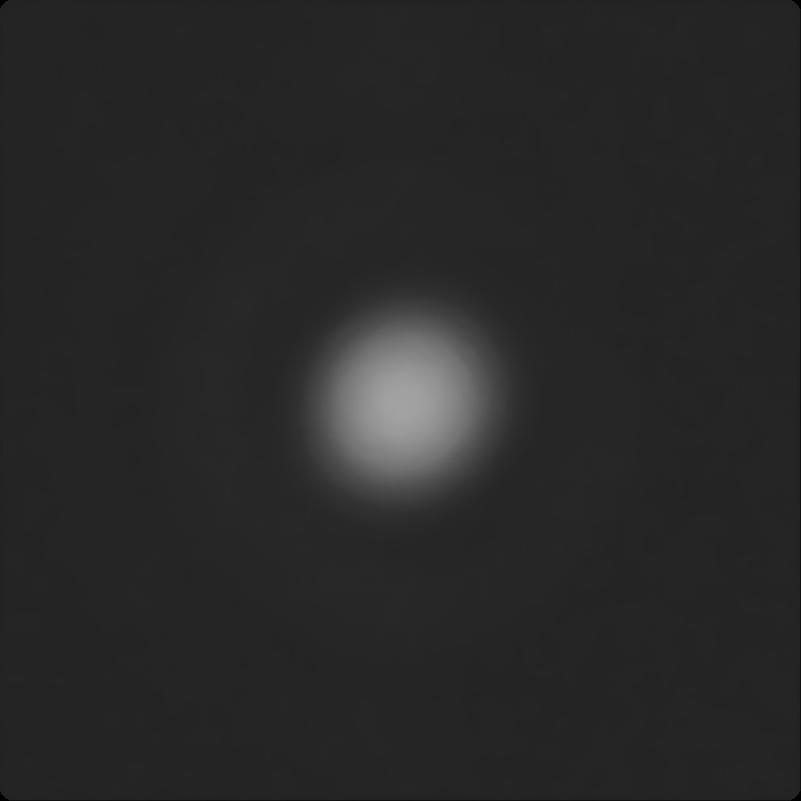

# HDRI_Point_spread_function
High Dynamic Range of Point Spread Function

## 使用方法

1. 創建一個新資料夾在 `TestImage` 內，新資料夾內放入不同曝光時間的照片。
2. 新增一個 `image_list.txt` 在照片旁邊。
   - `image_list.txt` 內寫入對應的圖片檔名與曝光時間 (s)。

例如:
```plaintext
# Filename    exposure
result_4.jpg  0.0625
result_5.jpg  0.03125
result_6.jpg  0.015625
result_7.jpg  0.0078125
```
## Exposure = 0.0625 s

## Exposure = 0.03125 s

## Exposure = 0.015625 s

## Exposure = 0.0078125 s

## HDRI結果


## 環境
- Python 3.7
- numpy
- cv2

## 安裝
你可以使用以下命令來安裝所需的套件：
```bash
pip install numpy opencv-python
